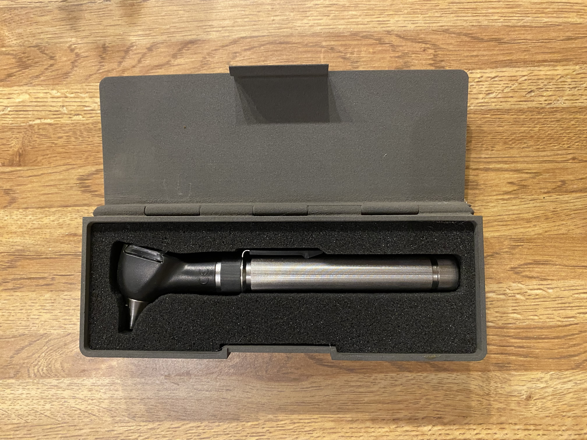

# PocketOtoscopeCase
This repository contains STL and DXF files for a custom 3D printed case and foam inserts designed specifically for the Welch Allyn Pocket Otoscope.

Image Description: A gray otoscope case with a foam insert inside of it. An otoscope is sitting in the foam. 

One of the files contained in this project is a modified version of :

- [Pencil case & Ruler by BookLedge](https://www.thingiverse.com/thing:4259572)
- **License**: [CC BY 4.0](https://creativecommons.org/licenses/by/4.0/)
- **Modifications made**: The height of the model was adjusted to accommodate a foam insert for a pocket otoscope, along with minor cosmetic changes. Foam inserts and additional materials are my original designs. 

---

This modified file is distributed under Apache License, 2.0

